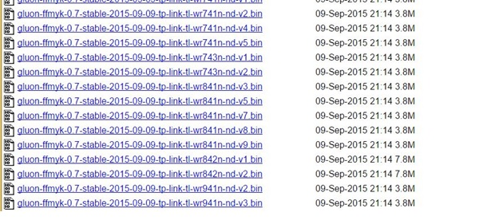
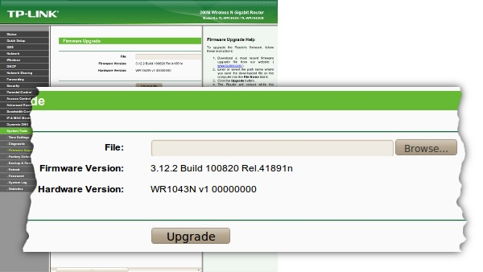
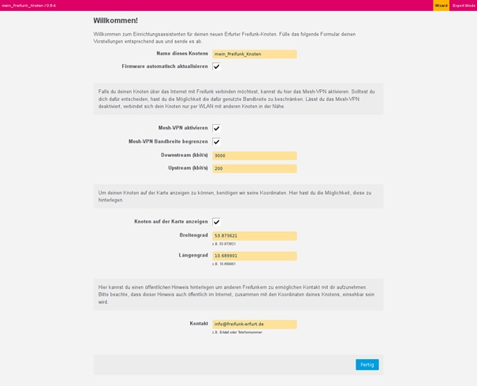
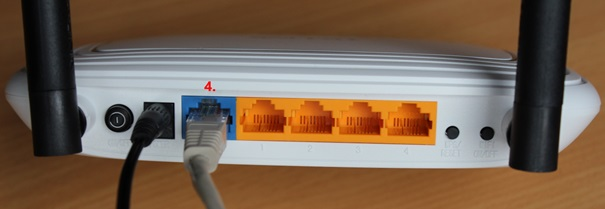

#Was wird gebraucht:

* Internetanschluss bzw. den Zugang über einen bestehenden Freifunkknoten

* Ein passendes Firmwareimage für dein Router. Du kannst es dir unter [http://images.freifunk-westerwald.de/](http://images.freifunk-westerwald.de/) herunterladen, wir erklären das nachher noch genauer.

* Ein Router der kompatible mit unserer Firmware ist. Eine Liste mit Router die du verwenden kannst findest du in der Download Seite der Images. (siehe Image finden und herrunterladen)

Wenn du ein neuen Router kaufen möchtest, empfehlen wir folgende Modelle :

|Hersteller|Modell|Anwendung|Preis|
|----------|------|---------|-----| 	
|TP-Link|WR842N |Einsteigermodell und kleine Anwendungen| ca 30 Euro |
|TP-Link|WR1043ND |für gehobene Ansprüche, 5GHz, für Gastronomie und ähnliches| ca 50 Euro |

> Achtung: Beachte bitte beim Kauf das es auch von einem Routermodell mehre Versionen geben kann. Im Einzelhandel kannst du das meist am Aufdruck auf dem Karton die genaue Version erkennen. Bei Online-Händler musst du auf „gut Glück“ Bestellen oder die Version dort erfragen.

#Image finden und Herunterladen

Link : [http://images.freifunk-westerwald.de/](http://images.freifunk-westerwald.de/)

Du siehst zunächst die Regionen für die wir Firmwares anbieten. Wähle deine Region aus und wähle danach den Ordner „stable“. Als nächstes findest du zwei Unterordner. Der Ordner „factory“ ist für das erste mal wenn du ein neuen Router Installieren möchtet. Also von der original Firmware Version deines Router zur Freifunk. Der Ordner „sysupgrade“ ist für ein Router der schon Freifunkrouter ist. Diese sind für ein Update der Freifunk Firmware. Öffne nun zuerst den Ordner „factory“

Wenn du auf unserem Server eine Liste mit Images gefunden hast sollte das in etwa so aussehen :

Die Dateinamen sind immer entsprechender Syntax aufgebaut :

gluon - ffww - Firmware-Version - Hersteller – Routertyp – Hardware-Version .bin

Dateiendung ist in der Regel immer .bin. In der Liste siehst du noch das Dateidatum und die Dateigröße in MB. Hast du das passende Image für ein Router gefunden, dann lade dieses runter.

Hier findest du alle Freifunk unsere Images. Wenn du unter folgenden Links immer noch kein passendes Image gefunden hast, schreib uns einfach an unter Support@freifunk-westerwald.de an oder noch besser registriere dich direkt auf unserer Mailingliste und schreibe uns dort (siehe [https://www.freifunk-westerwald.de/mitmachen](http://www.freifunk-westerwald.de/mitmachen)). Wir versuchen dann eine Lösung zu finden.

#Image Installieren „Flashen“

Jetzt musst du das Image auf dein Freifunk Router Installieren. Als erstes, trenne bitte alle Netzwerkkabel, und schalte dein WLAN an deinem PC/Notebook aus. Verbinde jetzt dein Router mit deinem PC über das Netzkabel. Am Router ist das ein beliebiger Netzwerkanschluss (meist gelbe Anschlüsse) aber nicht der WAN Port.(meist blau) Starte den Router und warte einige Sekunden bis der gestartet ist. Du erkennst das dran das einige Kontroll-LED anfangen zu leuchten und zu flackern.

Öffne dann deinen Browser und rufe die Konfigurations-Seite des Routers auf. Die Adresse findest du in der Anleitung zu deinem Router. Meist ist das [http://192.168.0.1](http://192.168.0.1) oder [http://192.168.1.1](http://192.168.1.1)

Du wirst dann nach einem Benutzer und Passwort gefragt. Auch diese Daten findest du im Handbuch deines Routers. Bei den TP-Link Geräten ist der Standard-Benutzer admin und das Passwort admin. Suche nun nach dem Menü-Punkt „Firmware Update“. Den findest du im Menü „System-Tools“

Klicke auf den Button „Browse“ und wähle die Freifunkfirmware aus die du vorher heruntergeladen hast. Jetzt klicke auf Upgrade. Nun wir aus deinem Router ein Freifunk Router.

>ACHTUNG Bitte beachte dass wärmend des Updates nichts am Router ausgesteckt oder gewackelt wird! Der Vorgang muss ohne Unterbrechung abgeschlossen werden. Hier ist etwas Geduld angesagt. Sollte er zum Beispiel vom Netz getrennt werden ist er meistens Defekt, wenn dir soetwas passiert, können wir ihn unter Umständen wieder herstellen. Schreib uns am besten eine Mail, da das ganze etwas aufwendiger ist.

#Einrichten des Freifunkrouters

Nach einem Neustart des Routers ist er nun fertig eingerichtet. Was du dir schon mal überlegen solltest:

Wie soll der Router heißen? Der Name sollte so gewählt sein das du den Router wiedererkennst. Zum Beispiel Straßenname oder Namens-Kürzel

Soll der Router auf der Freifunk Karte sichtbar werden? Du kannst entscheiden ob dein Router auf der Karte sichtbar wird. Das kann anderen Menschen helfen ein Freifunk in seiner Nähe zu finden. Wenn du dein Router auf der Karte anzeigen möchtest aber die Koordinaten nicht kennst, öffne open street maps oder google maps. Dort kannst du dann den Standort suchen und dir die genauen Koordinaten anzeigen lassen.

öffne jetzt im Browser die Seite [http://192.168.1.1](http://192.168.1.1) auf und stelle alles so ein, wie du es haben möchtest.

Nach klicken auf „Fertig“ hast du dein Router fertig eingerichtet.

Wir bitten dich in deinem Router deine E-Mailadresse zu hinterlegen. Das erleichtert es uns, dich zu kontaktieren falls es Probleme mit deinem Router gibt. Bitte beachte, das diese E-Mailadresse öffentlich einsehbar ist. Wenn du das nicht möchtest, kannst du dich auch auf unserer Mailingliste (siehe [https://freifunk-westerwald.de/mitmachen/](https://freifunk-westerwald.de/mitmachen/))  registrieren. Dort ist deine E-Mailadresse nicht öffentlich einsehbar.

>ACHTUNG: Wir empfehlen ausdrücklich kein SSH Passwort auf deinem Router zu verwenden. Der Router ist aus dem Internet erreichbar und Passwörter sind nicht sicher, da die ein Angreifer sehr viel Zeit zum ausproboieren hat.
Wenn du dich per SSH auf deinem Router einloggen möchtest, verwende einen SSH Key. Wir werden den Login per Passwort in einer der nächsten Firmware versionen entfernen.

Zu Abschluss kannst du jetzt deinen neuen Freifnkrouter an deinem Internet Anschluss installieren. Stecke einfach ein Netzkabel von deinem Internetanschluss auf den blauen WAN Anschluss des Freifunkrouters. Damit ist die Installation fertig!

#Ändern der Daten im Router - Config Mode

Möchtest du die Daten, wie zum Beispiel die Koordinaten, ändern musst du zuerst dein Router in den „Config Mode“ versetzten. Das geht ganz einfach.

Starte dein Router falls der nicht an ist. Warte bis der Router betriebsbereit ist. Trenne alle Netzkabel.
Drücke auf der Rückseite (er befindet sich meistens in der Nähe der LAN Ports) den Reset Knopf für ca. 5 Sekunden. Der Router startet dann nach einigen Sekunden neu. Warte bis der Router neu gestartet ist.

Verbinde jetzt dein PC mit einem LAN Port (gelb). Warte einige Sekunden. Öffne dann dein Browser und rufe die Seite [http://192.168.1.1](http://192.168.1.1) auf. Es sollte dann die Konfiguration aufgerufen werden.
Jetzt kannst du die Daten ändern. Nach dem Speichern startet der Router wieder in den normalen Modus. Verbinde jetzt wieder alle Kabel wie vorher.
Du kannst diesen Vorgang immer wieder wiederholen.

#Ich komme mit der Anleitung hier nicht zu recht Was nun ?

Manchmal läuft nicht alles wie gewünscht. Du kannst ganz einfach Kontakt zu uns aufbauen. Sende uns einfach eine Mail mit deinen Fragen an support@freifunk-westerwald.de oder trage dich in unsere Mailingliste ein.
Deine Fragen werden auf der Mailingliste dann an alle Freifunker aus unserer Community weitergeleitet.
Oder besuche uns auf einem unsere regelmäßigen Treffen. Wir zeigen dir gerne wie du deine Router installieren kannst und helfen dir.

> Die Inhalte stehen unter der CC Attribution-Share Alike 3.0 Unported Lizenz und wurden Ursprünglich durch Mitglieder von Freifunk MYK erstellt. (http://wiki.freifunk-myk.de/wiki/anleitung)
